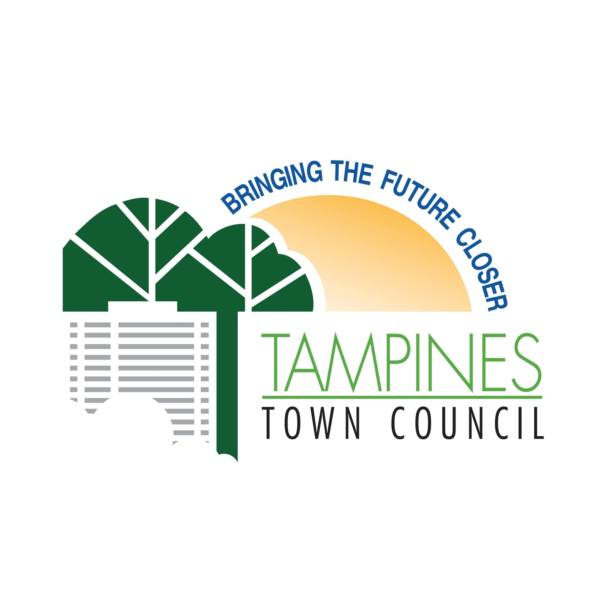
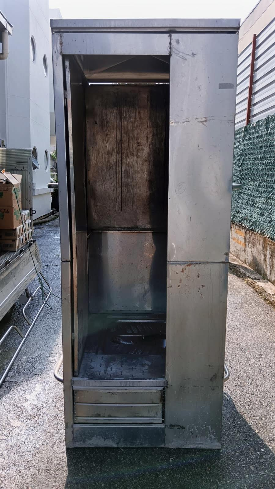
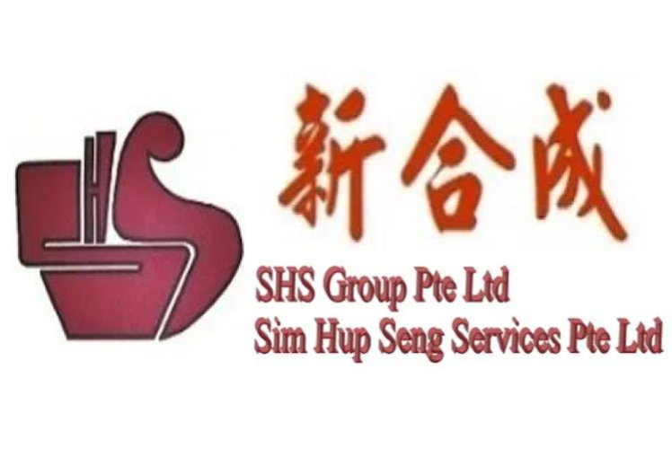
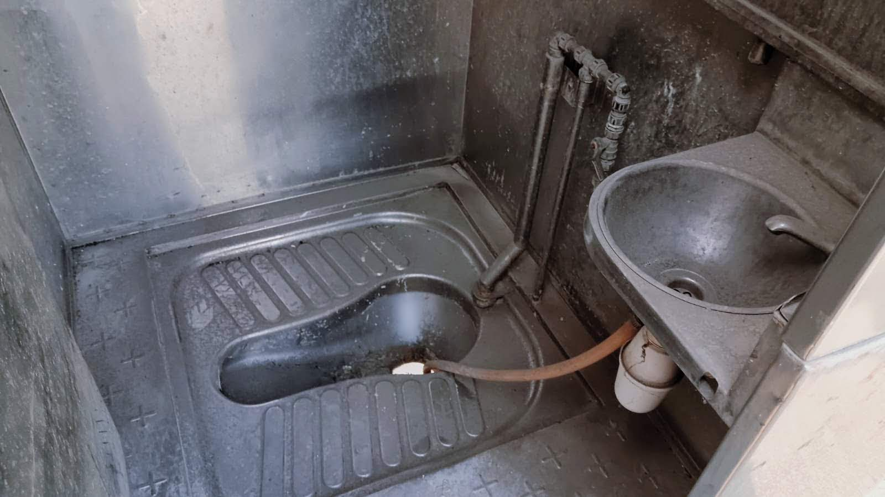
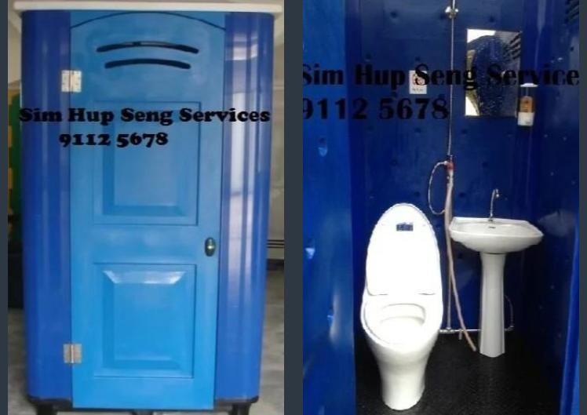
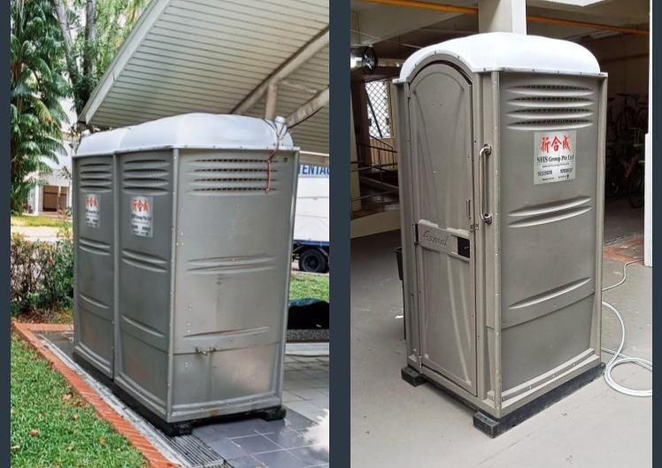

<h2>Why Us? </h2>

The  SHS  in Sim Hup Seng Services (SHS Group) embodies our principles: 

 S <b>afety</b>

We design our toilets for <b> safety </b>, such as elderly friendly usage with safety handrails, sitting-style toilet bowls, low steps etc. (<a href="toilets">click here</a> for more info on our toilets). 

 H <b>onesty</b>

We believe in <b> honest </b> prices and we are committed to giving upfront transparent quotes. No hidden costs!

 S <b>incerity</b>

We take pride in our trade -- designining, building and delivering toilets with <b>sincerity</b> and a personal touch. We believe that our actions will speak for us and our sincerity will come through in our work.

 

<h2>Recognition</h2>

	

	

    We are honored to have our efforts recognized as Sim Hup Seng Services (SHS Group) was the <b>first Portable Toilet Rental Company</b> permissioned to install our 'Elder-Friendly' Portable Manhole Toilets for use in the Tampines Estate, by the Town Council.  
    For over 20 years, <b>Customer comfort</b> and <b>User Friendliness</b> has always been the top priority for Sim Hup Seng Services (SHS Group), and we believe that these efforts go the long way.  
	

	
<h2>Our Humble Beginnings</h2>
Sim Hup Seng has a long history, stretching back to the 1980s. From generation to generation, this business and the service philosophy was passed down through the family line. 

Sim Hup Seng Services (SHS Group) has gone through many remarkable changes since its humble origins. Thomas, the current owner of the business, has repeatedly re-designed the Portable Toilets into the present day <b>fiber-glass manhole toilets with a range of premium facilities</b> to meet your needs. From a one man show, our business has grown steadily over the last decades.

<h4>Our Timeline</h4>
Retrace our footsteps here!

  <section class="ag-section">
    

      

        

          

        

        

          

            

              

                
1980

              

              

                
Beginnings

              

            

            

              

                

                  
                

                

                  
Beginnings

                  

                    Mr Lim SY, the current owner's father, started this business from scratch by himself, with a mere 10 portable toilets.  
                     

                    新合成是个30多年的老招牌。那时林瑞远先生自己亲手创办了新合成，公司仅有10只流动厕所。
                  

                

              

              

            

          

          

            

              

                
Taking over the business

              

              

                
2009

              

            

            

              

                

                  
                

                

                  
Taking over the business

                  

                    The current owner, Thomas was then entrusted with Sim Hup Seng from Mr. Lim SY and renamed it to Sim Hup Seng Services. Being new in this sector, Thomas had big shoes to fill.  

                    Thomas老板在2009年尾开始帮忙父亲管理公司。Thomas认为做什么事都必须从最底层做起。做出租流动厕所的生意也一样，必须自己去体验搬运厕所的酸甜苦乐，才会从日晒雨淋中了解到员工们工作的辛酸和得到一些意想不到的启发。
                  

                

              

              

            

          

          

            

              

                
2010

              

              

                
Opportunity for Change

              

            

            

              

                

                  
                

                

                  
Opportunity for Change

                  

                    Thomas witnessed an old lady having difficulty climbing up the previous Stainless Steel Portable Toilet. 
                    The high raised steps leading up to the toilet, the squatting-style toilet bowl and the often times slippery flooring posed serious problems for elderly toilet users.  

                    有一次，在Thomas带领员工去服务一组丧礼时，他目睹一位年迈的老妇极辛苦的想要攀上铁厕的夹梯。他连忙上前扶持老妇并协助她登上铁厕。老妇抱怨自己已老迈，双脚无力，要登上夹梯上个厕所已是一个很艰难的挑战。如厕时还要她蹲下，简直是苦不堪言。
                    她的话一字一字地触动了Thomas，也刺痛了他的心。于是Thomas开始了他的新构思。他想要设计出比较经济实惠，而且非常适用于乐龄人士的流动厕所。
                  

                

              

              

            

          

          

            

              

                
The New Age

              

              

                
2011

              

            

            

              

                

                  
                

                

                  
The New Age

                  

                  Thomas worked hard re-designing a new fleet of toilets with no raised steps, sitting-style ceramic bowls, elderly handrails and anti-slip flooring. With bated breath, the toilet was launched to market.  

                  整整用了8个月的时间设计和改良，第一批为乐龄人士而设计的厕所终于在2011年9月面市了。这10只用塑料厕改装的厕所，厕内面积宽大，厕所的地板只离地少于15cm，而且也安装了陶瓷坐式马桶。这样一来，乐龄人只须踏一小步就能进入厕内。更重要的是双腿无力的乐龄人可以坐在马桶上，不必在担忧双脚无法蹲的问题了。而且厕所里也设有防滑地板，花洒，镜子，洗手盆，吊衣架等等。
                  

                

              

              

            

          

          

            

              

                
2013

              

              

                
A Huge Success

              

            

            

              

                

                  
                

                

                  
A Huge Success

                  

                    The new fleet of "elderly-friendly" toilets was a breakthrough in the industry and were extremely well-received by new and long-time customers alike.
                    Industry competitors also followed suit in Sim Hup Seng's footsteps, raising the bar for portable toilets in Singapore. 

                    这厕所广受乐龄人士欢迎。这使Thomas决定要全新改革，把所有的铁厕更换，引进了更多的乐龄人士的塑厕。第二批32架塑厕也因此在2013年5月面市了。这批新塑厕也势必为流动厕所这一行业带来一阵新风潮。
                  

                

              

              

            

          

          

            

              

                
The Service Mindset

              

              

                
2024

              

            

            

              

                

                  
                

                

                  
The Service Mindset

                  

                  Till today, Thomas still insists on the bringing the personal touch to each and every rental request. Thomas has been redesigning toilets every other year based on feedback and suggestions from customers.  

                  Thomas相信所有同行会跟风而改进自己的厕所以迎合市场的需求。他希望自己的创新能使流动厕所的水平提高，乐龄人士也因此不用再为使用流动厕所这事而烦恼了。
                  

                

              

              

            

          

        

      

    

  </section>

