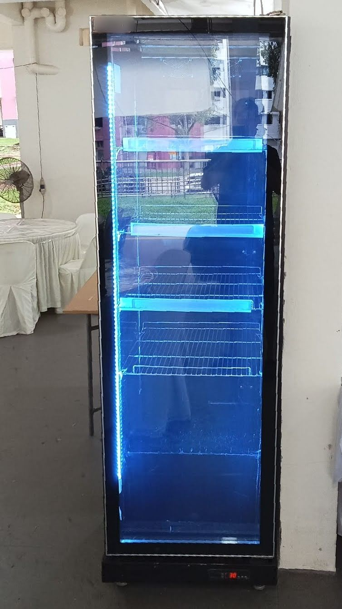
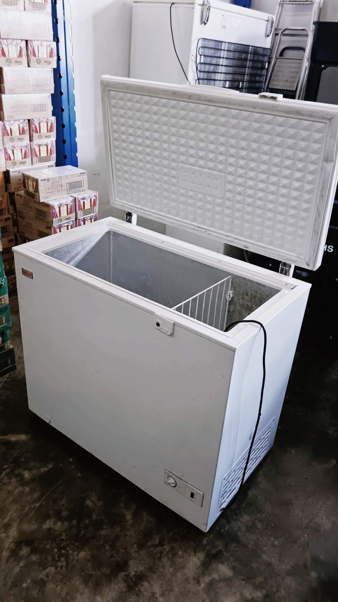
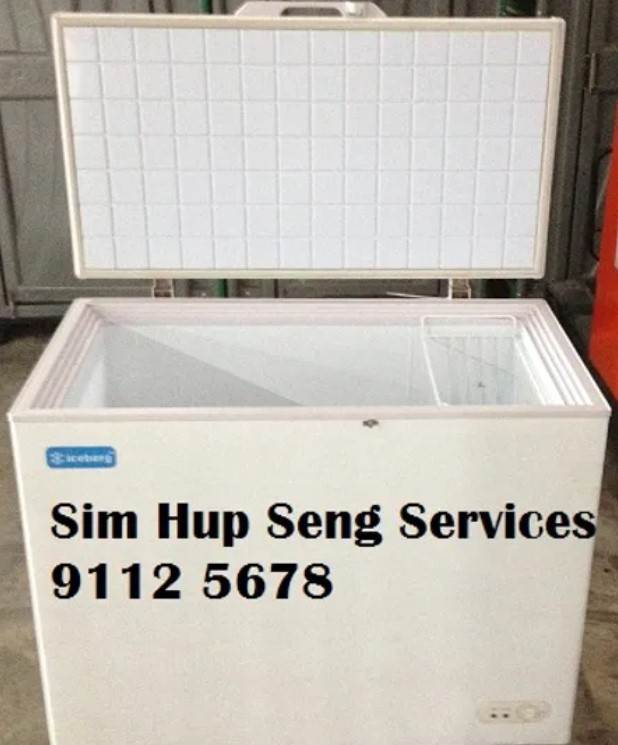

<section>
<h2>Fridge Rentals</h2>
All below fridges are available for rental.   

Our industrial sized chillers/freezer models have been carefully selected to provide the perfect cooling solution for drinks and beverages for gatherings and events. 

<section>

<h3><b>Brand new</b> Premium Upright Chiller Display Fridge</h3>
Newly acquired sleek black display fridges. Perfect for keeping beverages and small food items chill for events.
 
 
 
    

        

            <input type="radio" name="slides2" checked="checked" id="slide-31">
            <input type="radio" name="slides2" id="slide-32">
            <input type="radio" name="slides2" id="slide-33">
            <input type="radio" name="slides2" id="slide-34">
            <input type="radio" name="slides2" id="slide-35">
            <ul class="carousel3__slides">
                <li class="carousel3__slide">
                    <figure>
                        

                            
                        

                    </figure>
                </li>
                <li class="carousel3__slide">
                    <figure>
                        

                            
                        

                    </figure>
                </li>
                <li class="carousel3__slide">
                    <figure>
                        

                            
                        

                    </figure>
                </li>
                <li class="carousel3__slide">
                    <figure>
                        

                            
                        

                    </figure>
                </li>
                <li class="carousel3__slide">
                    <figure>
                        

                            
                        

                    </figure>
                </li>
            </ul> 
			
			<h4>Features:</h4>
			<ul>
				<li style="margin-left: 2em">Commercial Single door display refrigerator</li>
				<li style="margin-left: 2em">Double-layered glass door eliminates condensation while maintaining cool temperatures</li>
				<li style="margin-left: 2em">Interior LED lights</li>
				<li style="margin-left: 2em">Large capacity, 6 layers of shelves that fit most drinks and beverages</li>
				<li style="margin-left: 2em">Powerful Cooling & Circulation System</li>
			</ul>
			
            <ul class="carousel3__thumbnails">
                <li>
                    <label style="margin: 0" for="slide-31"></label>
                </li>
                <li>
                    <label style="margin: 0" for="slide-32"></label>
                </li>
                <li>
                    <label style="margin: 0" for="slide-33"></label>
                </li>
                <li>
                    <label style="margin: 0" for="slide-34"></label>
                </li>
                <li>
                    <label style="margin: 0" for="slide-35"></label>
                </li>
            </ul>
        

    

<h4>Features:</h4>
<ul>
	<li style="margin-left: 2em">Commercial Single door display refrigerator</li>
	<li style="margin-left: 2em">Double-layered glass door eliminates condensation while maintaining cool temperatures</li>
	<li style="margin-left: 2em">Interior LED lights</li>
	<li style="margin-left: 2em">Large capacity, 6 layers of shelves that fit most drinks and beverages</li>
	<li style="margin-left: 2em">Powerful Cooling & Circulation System</li>
</ul>

 
</section> 

<section>

<h3>Upright Chiller Display Fridge</h3>
White Upright Chiller Display fridges acquired in 2020. Excellent condition, perfect for keeping beverages and small food items chill for events.
 
Functionally very similar to the brand new <b>Premium</b> display fridges in the above, just acquired a couple years earlier.
 
 
 
    

        

            <input type="radio" name="slides" checked="checked" id="slide-1">
            <input type="radio" name="slides" id="slide-2">
            <input type="radio" name="slides" id="slide-3">
            <input type="radio" name="slides" id="slide-4">
            <ul class="carousel__slides">
                <li class="carousel__slide">
                    <figure>
                        

                            
                        

                    </figure>
                </li>
                <li class="carousel__slide">
                    <figure>
                        

                            
                        

                    </figure>
                </li>
                <li class="carousel__slide">
                    <figure>
                        

                            
                        

                    </figure>
                </li>
                <li class="carousel__slide">
                    <figure>
                        

                            
                        

                    </figure>
                </li>
            </ul> 
			
			<h4>Features:</h4>
			<ul>
				<li style="margin-left: 2em">Commercial Single door display refrigerator</li>
				<li style="margin-left: 2em">Double-layered glass door eliminates condensation while maintaining cool temperatures</li>
				<li style="margin-left: 2em">Interior LED lights</li>
				<li style="margin-left: 2em">Large capacity, 5 layers of shelves that fit most drinks and beverages</li>
				<li style="margin-left: 2em">Powerful Cooling & Circulation System</li>
			</ul>
			
            <ul class="carousel__thumbnails">
                <li>
                    <label style="margin: 0" for="slide-1"></label>
                </li>
                <li>
                    <label style="margin: 0" for="slide-2"></label>
                </li>
                <li>
                    <label style="margin: 0" for="slide-3"></label>
                </li>
                <li>
                    <label style="margin: 0" for="slide-4"></label>
                </li>
            </ul>
        

    

<h4>Features:</h4>
<ul>
	<li style="margin-left: 2em">Commercial Single door display refrigerator</li>
	<li style="margin-left: 2em">Double-layered glass door eliminates condensation while maintaining cool temperatures</li>
	<li style="margin-left: 2em">Interior LED lights</li>
	<li style="margin-left: 2em">Large capacity, 5 layers of shelves that fit most drinks and beverages</li>
	<li style="margin-left: 2em">Powerful Cooling & Circulation System</li>
</ul>
 

</section> 

<section>

<h3>Chest Freezer</h3>
Performant freezers to keep temperatures at around -18 degree celsius. Perfect for keeping more specialized food and cooking ingredients frozen for events.
 
 
    

        

            <input type="radio" name="slides4" checked="checked" id="slide-41">
            <input type="radio" name="slides4" id="slide-42">
            <input type="radio" name="slides4" id="slide-43">
            <input type="radio" name="slides4" id="slide-44">
            <ul class="carousel__slides">
                <li class="carousel__slide">
                    <figure>
                        

                            
                        

                    </figure>
                </li>
                <li class="carousel__slide">
                    <figure>
                        

                            
                        

                    </figure>
                </li>
                <li class="carousel__slide">
                    <figure>
                        

                            
                        

                    </figure>
                </li>
                <li class="carousel__slide">
                    <figure>
                        

                            
                        

                    </figure>
                </li>
            </ul> 
			
			<h4>Features:</h4>
			<ul>
				<li style="margin-left: 2em">Spacious and Large capacity</li>
				<li style="margin-left: 2em">Energy efficient and powerful compressor</li>
				<li style="margin-left: 2em">Removable wire baskets -- allow storing of smaller items for easy access</li>
				<li style="margin-left: 2em">Top down access, clear visibility</li>
			</ul>
			
            <ul class="carousel__thumbnails">
                <li>
                    <label style="margin: 0" for="slide-41"></label>
                </li>
                <li>
                    <label style="margin: 0" for="slide-42"></label>
                </li>
                <li>
                    <label style="margin: 0" for="slide-43"></label>
                </li>
                <li>
                    <label style="margin: 0" for="slide-44"></label>
                </li>
            </ul>
        

    

<h4>Features:</h4>
<ul>
	<li style="margin-left: 2em">Spacious and Large capacity</li>
	<li style="margin-left: 2em">Energy efficient and powerful compressor</li>
	<li style="margin-left: 2em">Removable wire baskets -- allow storing of smaller items for easy access</li>
	<li style="margin-left: 2em">Top down access, clear visibility</li>
</ul>
 

</section>