<section>
<h2>Funeral Management Services</h2>
<blockquote>
Our thoughts and prayers are always with you. 
</blockquote>
Sim Hup Seng Services wholeheartedly believes in <b>honoring every life with utmost respect</b> and providing the best support to send loved ones off on their last journey. 
Our team and capable partners with decades of experience go the long way to provide <b>tailored, professional and respectful services for all faiths</b>.
  
We promise and fully commit to <b>transparent pricing</b> for all packages. As each package is fully customized, please contact us for further information at <b style="font-weight: 800; font-size: 1em; color: #660000"><a href="https://api.whatsapp.com/send/?phone=6591125678"> (65) 9112 5678 </a></b>.
  

<h3>Buddhist/Taoist <b>Funeral Management Services:</b></h3>
Buddhist/Taoist funerals are usually conducted in void decks and parlors. Some might opt to invite monks onsite to offer prayers and memorial services. Food, beverages and light refreshments can be arranged for guests paying respects.

 
 
 
    

        

            <input type="radio" name="slides5" checked="checked" id="slide-51">
            <input type="radio" name="slides5" id="slide-52">
            <input type="radio" name="slides5" id="slide-53">
            <input type="radio" name="slides5" id="slide-54">
            <input type="radio" name="slides5" id="slide-55">
            <input type="radio" name="slides5" id="slide-56">
            <input type="radio" name="slides5" id="slide-57">
            <input type="radio" name="slides5" id="slide-58">
            <input type="radio" name="slides5" id="slide-59">
            <ul class="carousel5__slides">
                <li class="carousel5__slide">
                    <figure>
                        

                            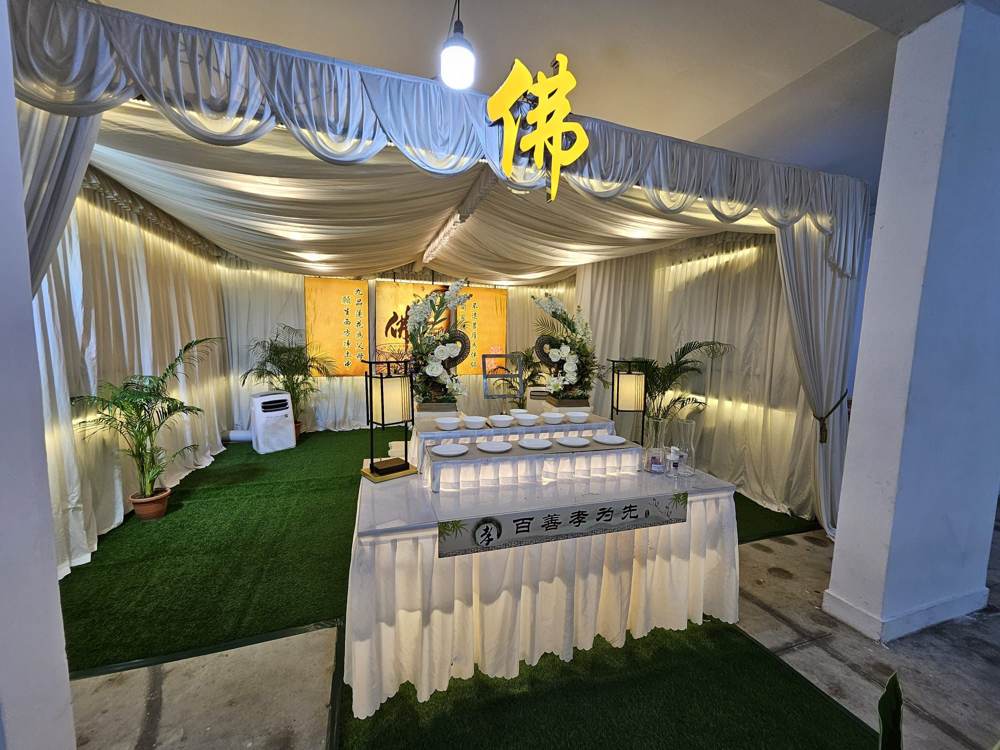
                        

                    </figure>
                </li>
                <li class="carousel5__slide">
                    <figure>
                        

                            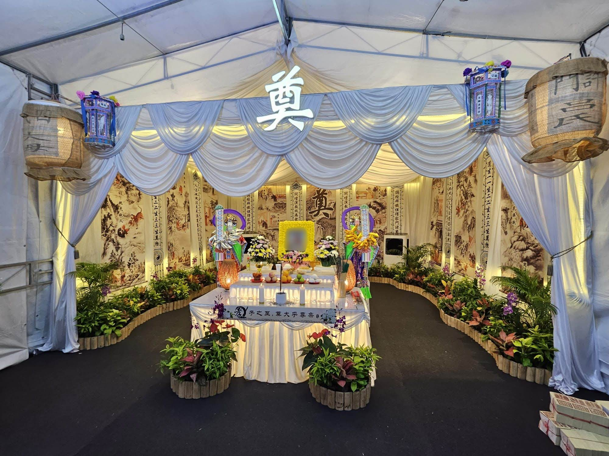
                        

                    </figure>
                </li>
                <li class="carousel5__slide">
                    <figure>
                        

                            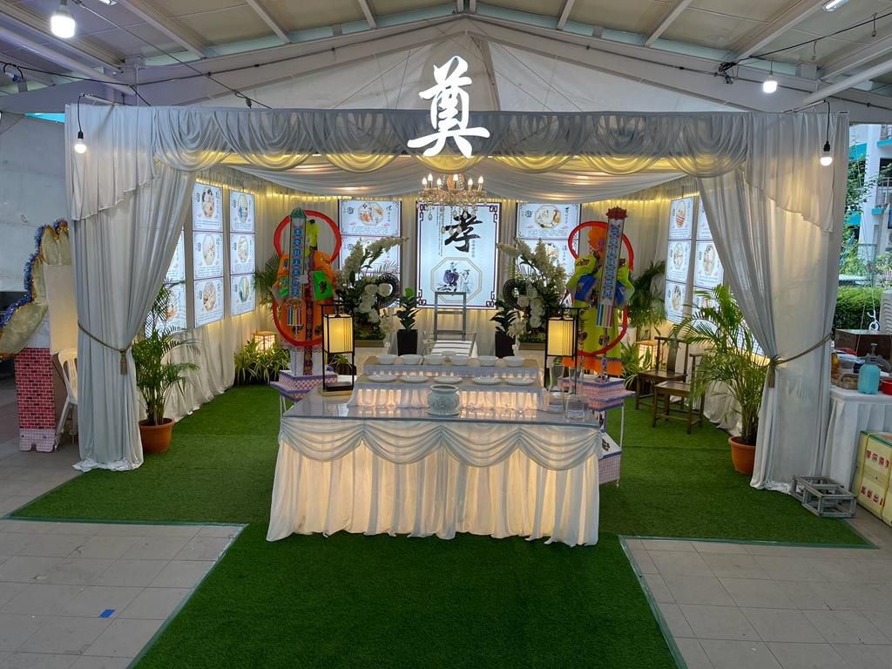
                        

                    </figure>
                </li>
                <li class="carousel5__slide">
                    <figure>
                        

                            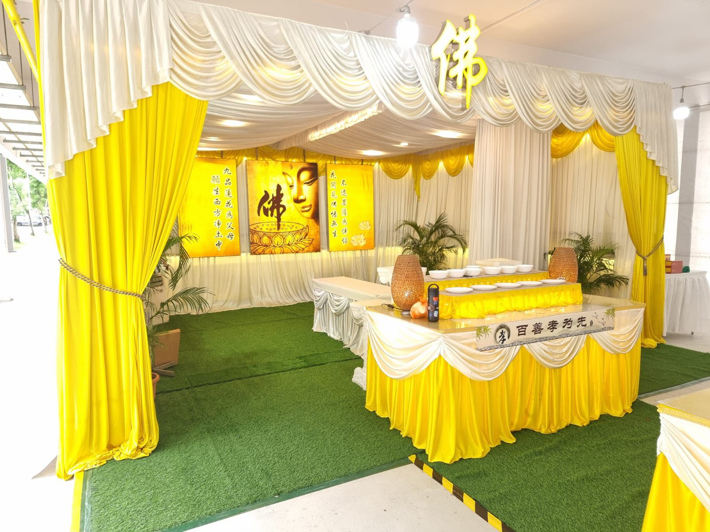
                        

                    </figure>
                </li>
                <li class="carousel5__slide">
                    <figure>
                        

                            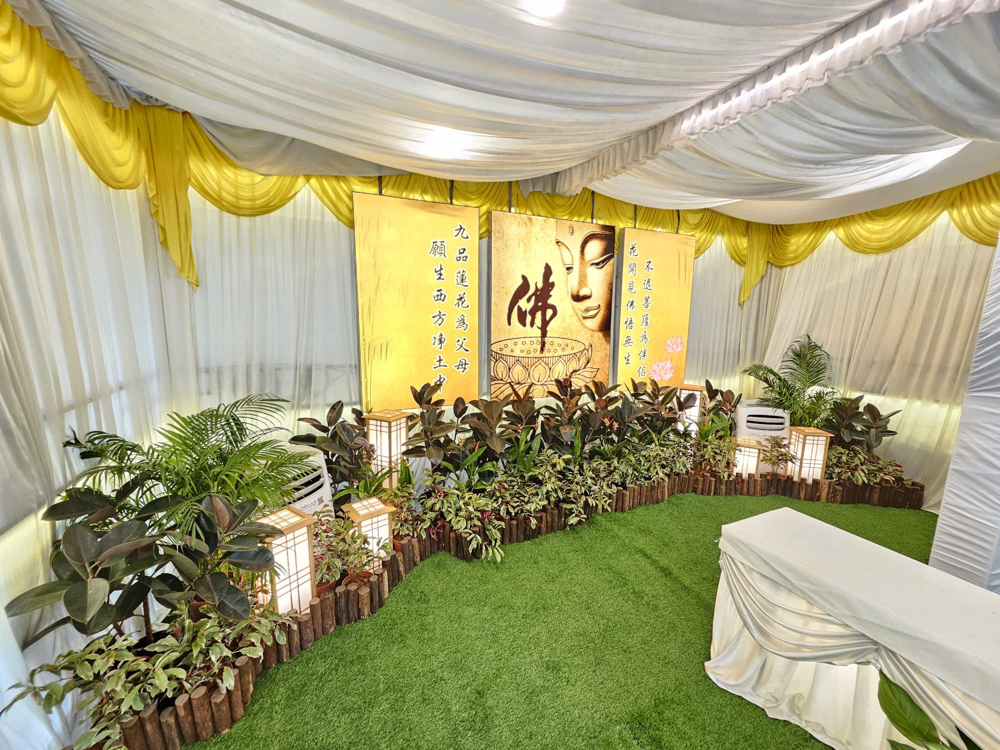
                        

                    </figure>
                </li>
                <li class="carousel5__slide">
                    <figure>
                        

                            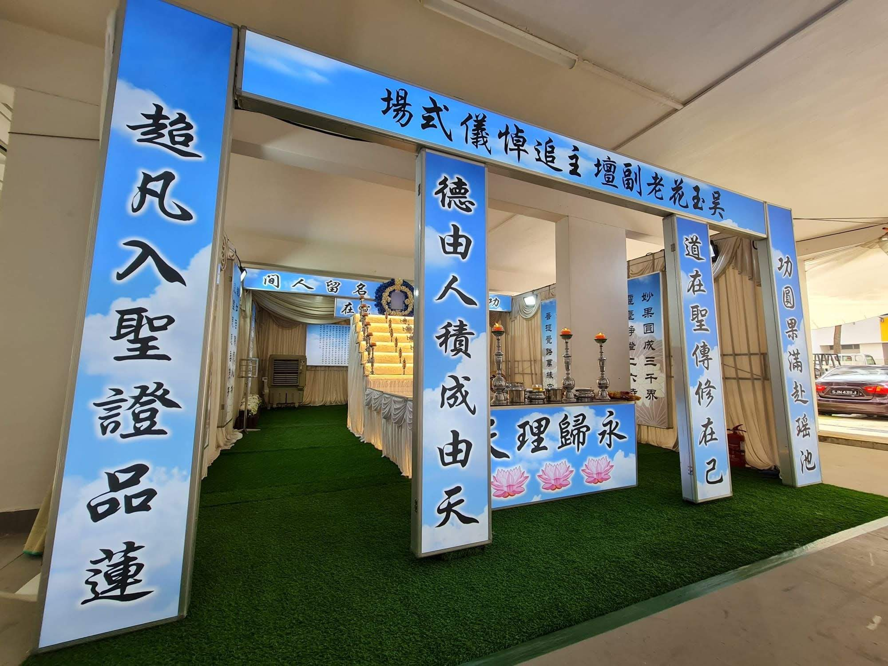
                        

                    </figure>
                </li>
                <li class="carousel5__slide">
                    <figure>
                        

                            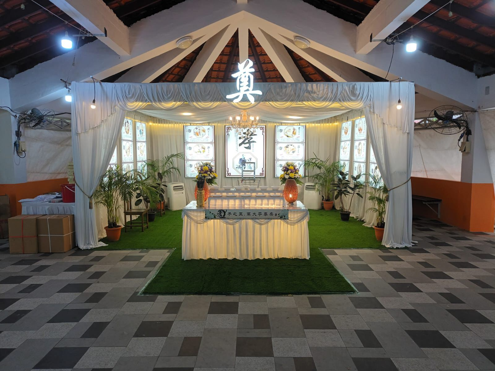
                        

                    </figure>
                </li>
                <li class="carousel5__slide">
                    <figure>
                        

                            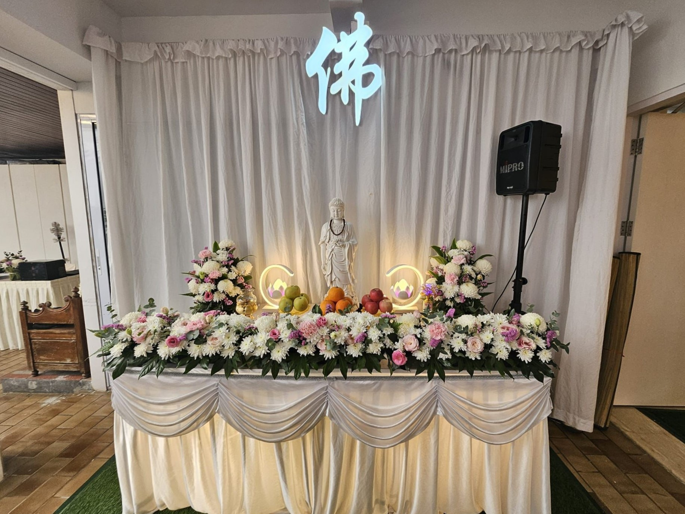
                        

                    </figure>
                </li>
                <li class="carousel5__slide">
                    <figure>
                        

                            
                        

                    </figure>
                </li>
            </ul> 
			
			<ul>
                <li style="margin-left: 2em">Experienced professionals to handle funeral processions, rituals and setup arrangements. </li>
                <li style="margin-left: 2em">Tailored guidance on customary rites from temple contacts, e.g. chants and wakes. </li>
				<li style="margin-left: 2em">Wide range of products for different burial and/or cremation needs. </li>
				<li style="margin-left: 2em">Highly-personalized planning, consultations related to budget and preferences.</li>
			</ul>
			
            <ul class="carousel5__thumbnails">
                <li>
                    <label style="margin: 0" for="slide-51"></label>
                </li>
                <li>
                    <label style="margin: 0" for="slide-52"></label>
                </li>
                <li>
                    <label style="margin: 0" for="slide-53"></label>
                </li>
                <li>
                    <label style="margin: 0" for="slide-54"></label>
                </li>
                <li>
                    <label style="margin: 0" for="slide-55"></label>
                </li>
                <li>
                    <label style="margin: 0" for="slide-56"></label>
                </li>
                <li>
                    <label style="margin: 0" for="slide-57"></label>
                </li>
                <li>
                    <label style="margin: 0" for="slide-58"></label>
                </li>
                <li>
                    <label style="margin: 0" for="slide-59"></label>
                </li>
            </ul>
        

    

    <ul>
        <li style="margin-left: 2em">Experienced professionals to handle funeral processions, rituals and setup arrangements. </li>
        <li style="margin-left: 2em">Tailored guidance on customary rites from temple contacts, e.g. buddhist chants and wakes. </li>
        <li style="margin-left: 2em">Wide range of products for different burial and/or cremation needs. </li>
        <li style="margin-left: 2em">Highly-personalized planning, consultations related to budget and preferences.</li>
	</ul>

 

</section> 

<section>
 
<h3>Christian/Catholic<b>Funeral Management Services:</b></h3>
Christian/Catholic funerals offer families and friends a time and place to honor the life of an important loved one, mourn their loss and get together to remember them. Locations may differ based on personal preferences, this can be held in void decks, funeral parlours, churches etc.
 
 
 
    

        

            <input type="radio" name="slides6" checked="checked" id="slide-61">
            <input type="radio" name="slides6" id="slide-62">
            <input type="radio" name="slides6" id="slide-63">
            <input type="radio" name="slides6" id="slide-64">
            <input type="radio" name="slides6" id="slide-65">
            <input type="radio" name="slides6" id="slide-66">
            <input type="radio" name="slides6" id="slide-67">
            <input type="radio" name="slides6" id="slide-68">
            <input type="radio" name="slides6" id="slide-69">
            <ul class="carousel5__slides">
                <li class="carousel5__slide">
                    <figure>
                        

                            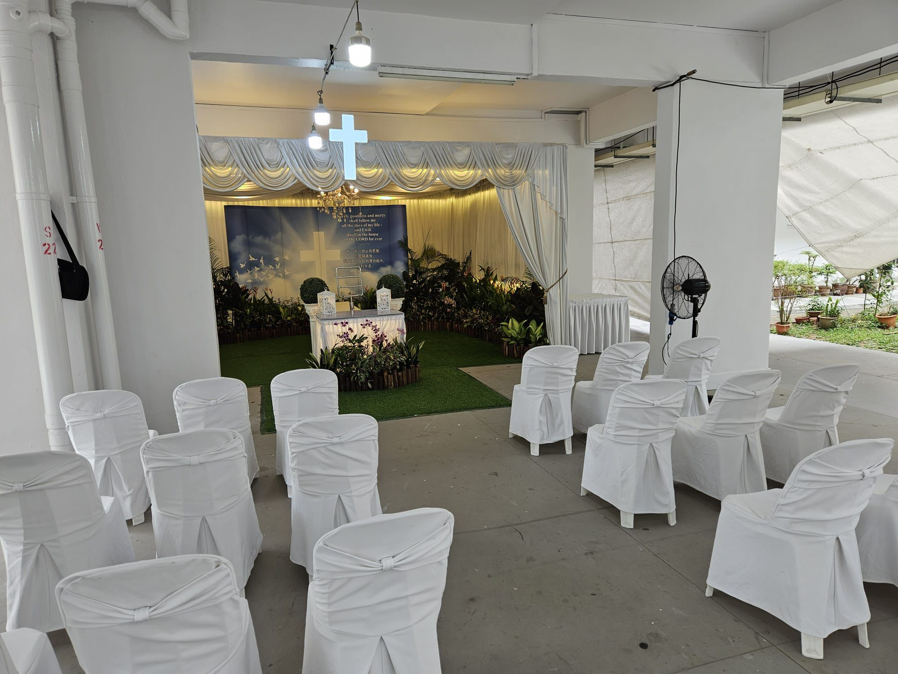
                        

                    </figure>
                </li>
                <li class="carousel5__slide">
                    <figure>
                        

                            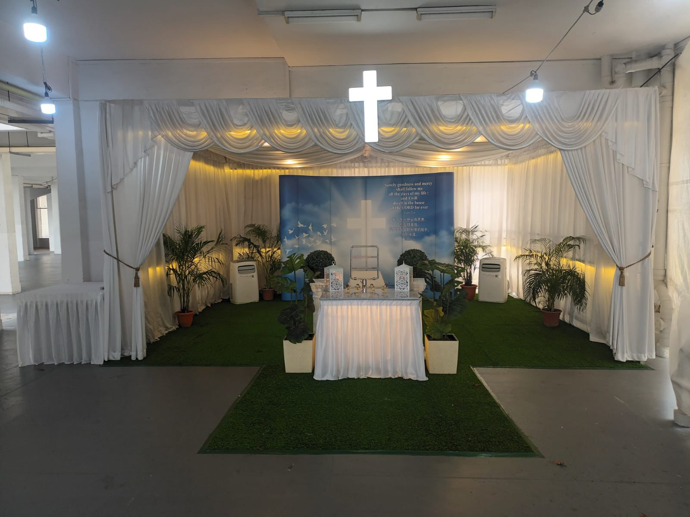
                        

                    </figure>
                </li>
                <li class="carousel5__slide">
                    <figure>
                        

                            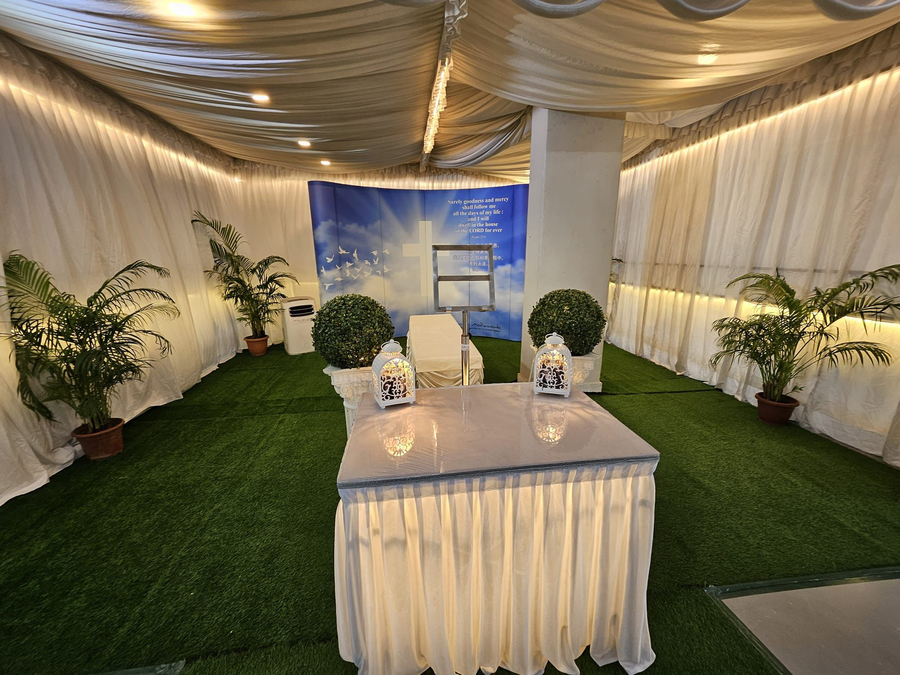
                        

                    </figure>
                </li>
                <li class="carousel5__slide">
                    <figure>
                        

                            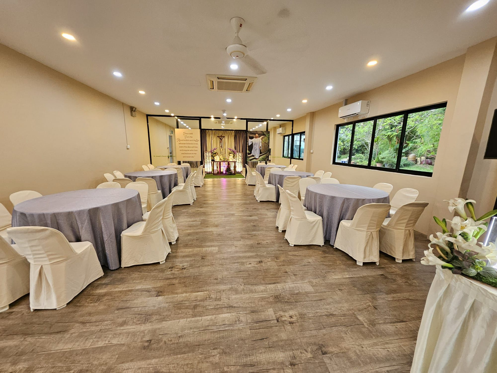
                        

                    </figure>
                </li>
                <li class="carousel5__slide">
                    <figure>
                        

                            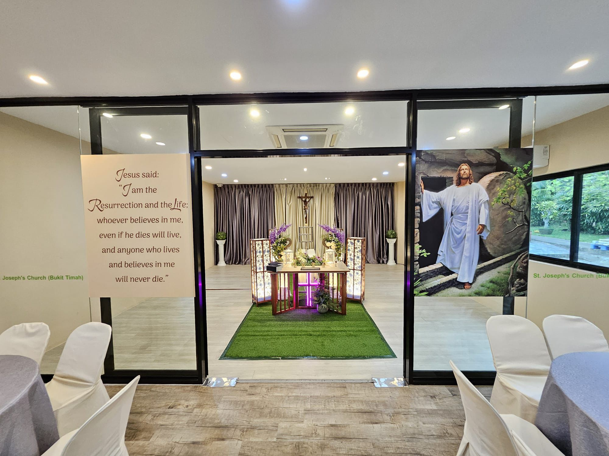
                        

                    </figure>
                </li>
                <li class="carousel5__slide">
                    <figure>
                        

                            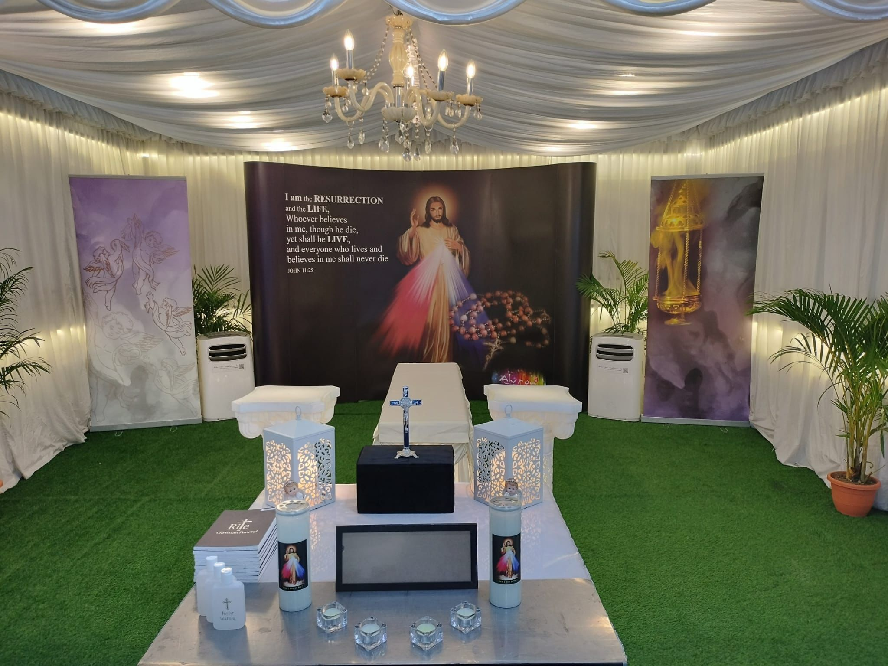
                        

                    </figure>
                </li>
                <li class="carousel5__slide">
                    <figure>
                        

                            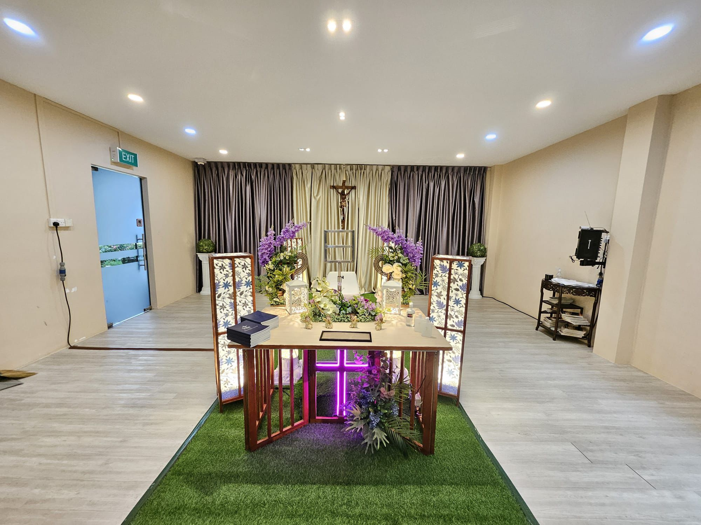
                        

                    </figure>
                </li>
                <li class="carousel5__slide">
                    <figure>
                        

                            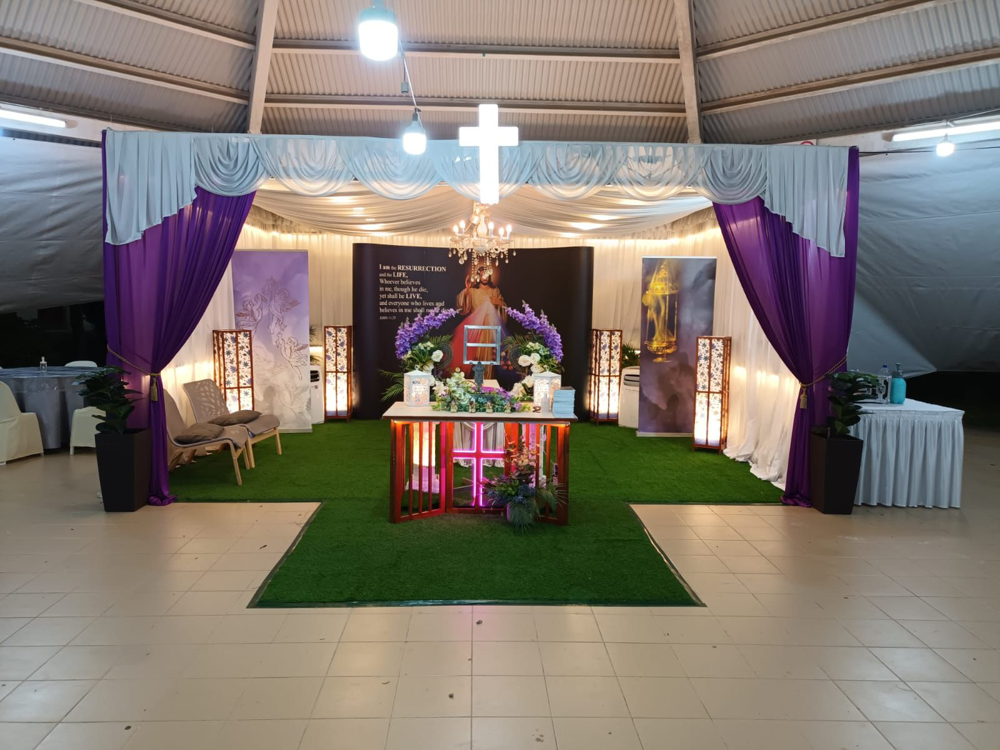
                        

                    </figure>
                </li>
                <li class="carousel5__slide">
                    <figure>
                        

                            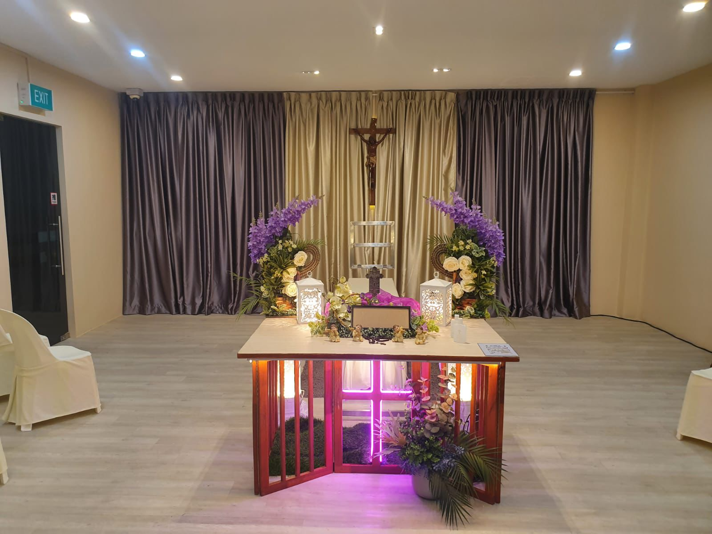
                        

                    </figure>
                </li>
            </ul> 
			
			<ul>
                <li style="margin-left: 2em">Experienced professionals to handle funeral processions, rituals and setup arrangements. </li>
                <li style="margin-left: 2em">Cermonies with prayers, sermons, readings, speeches and singing of hymms in remembrance. </li>
				<li style="margin-left: 2em">Wide range of products for different burial and/or cremation needs. </li>
				<li style="margin-left: 2em">Highly-personalized planning, consultations related to budget and preferences.</li>
			</ul>
			
            <ul class="carousel5__thumbnails">
                <li>
                    <label style="margin: 0" for="slide-61"></label>
                </li>
                <li>
                    <label style="margin: 0" for="slide-62"></label>
                </li>
                <li>
                    <label style="margin: 0" for="slide-63"></label>
                </li>
                <li>
                    <label style="margin: 0" for="slide-64"></label>
                </li>
                <li>
                    <label style="margin: 0" for="slide-65"></label>
                </li>
                <li>
                    <label style="margin: 0" for="slide-66"></label>
                </li>
                <li>
                    <label style="margin: 0" for="slide-67"></label>
                </li>
                <li>
                    <label style="margin: 0" for="slide-68"></label>
                </li>
                <li>
                    <label style="margin: 0" for="slide-69"></label>
                </li>
            </ul>
        

    

	<ul>
        <li style="margin-left: 2em">Experienced professionals to handle funeral processions, rituals and setup arrangements. </li>
        <li style="margin-left: 2em">Cermonies with prayers, sermons, readings, speeches and singing of hymms in remembrance. </li>
		<li style="margin-left: 2em">Wide range of products for different burial and/or cremation needs. </li>
		<li style="margin-left: 2em">Highly-personalized planning, consultations related to budget and preferences.</li>
	</ul>

 

</section> 

<section>
 
<h3>Free Thinker <b>Funeral Management Services:</b></h3>
Funerals for free thinkers, atheists, and non religious people offer a place for friends and families to honor the life of an important loved one, mourn their loss and draw closure to begin moving on. Sim Hup Seng fully supports those seeking non religious funeral ceremonies and memorial services to prepare for a meaningful send off.
 
 

	
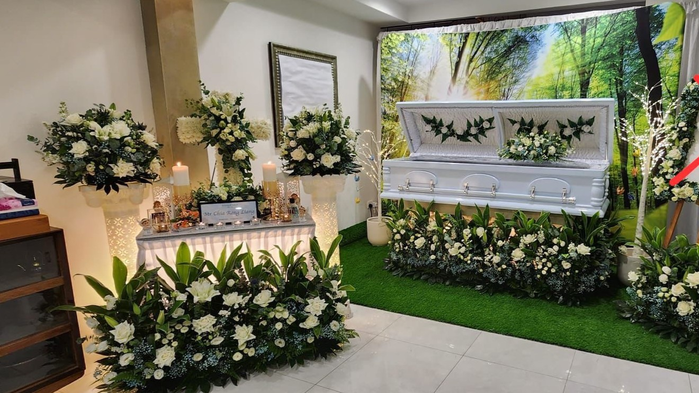

	

    <ul>
        <li style="margin-left: 2em">Experienced professionals to handle funeral, caskets and setup arrangements. </li>
	    <li style="margin-left: 2em">Wide range of products for different burial and/or cremation needs. </li>
	    <li style="margin-left: 2em">Highly-personalized planning, consultations related to budget and preferences.</li>
    </ul>
    

</section> 